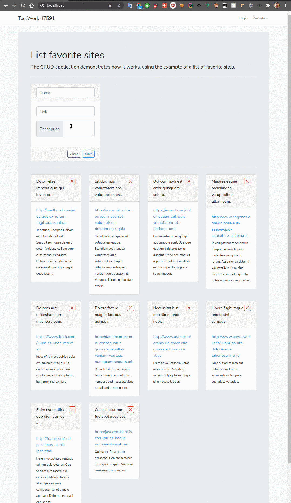

# Application to saving favorite sites.



## Start application

1. Setting up the environment.

```
./vendor/bin/sail up 
```

To run in the background.

```
./vendor/bin/sail up 
```

2. Preparing the database by execute migrations.


```
./vendor/bin/sail php artisan migrate 
```

3. Preparing the database by execute seeds.


```
./vendor/bin/sail php artisan db:seed 
```

4. Command for testing API endpoints. 

```
./vendor/bin/sail php artisan test
```
